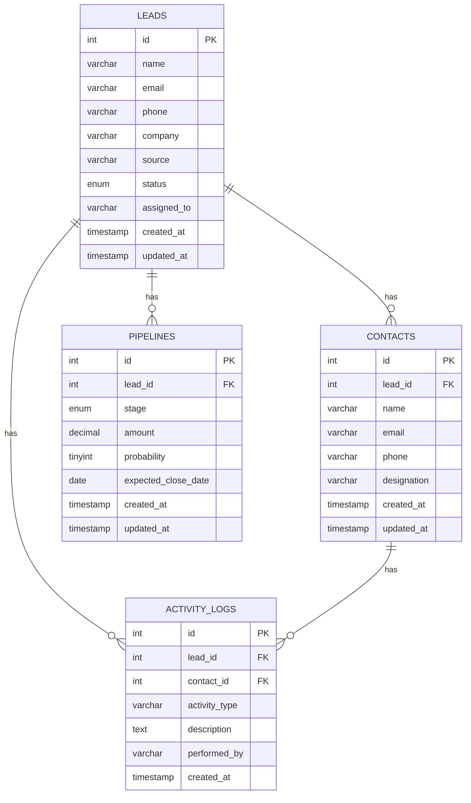

# Entity Relationship Diagram (ERD)

## Entities & Relationships

- **Leads (1) → Contacts (Many)**
  One lead can have multiple contact persons.
- **Leads (1) → Pipelines (Many)**
  One lead can move through multiple pipeline/stage records over time.
- **Leads (1) → Activity Logs (Many)**
  One lead can have many logged activities.
- **Contacts (1) → Activity Logs (Many)**
  One contact can have many logged activities (nullable — a log can
  belong to a lead only, without a specific contact).

```
Leads (1) ────< Contacts (Many)
Leads (1) ────< Pipelines (Many)
Leads (1) ────< Activity Logs (Many)
Contacts (1) ─< Activity Logs (Many)
```

## Mermaid Diagram



## Table Summary

| Table          | Primary Key | Foreign Keys                                    |
|----------------|-------------|--------------------------------------------------|
| leads          | id          | —                                                |
| contacts       | id          | lead_id → leads.id (ON DELETE CASCADE)          |
| pipelines      | id          | lead_id → leads.id (ON DELETE CASCADE)          |
| activity_logs  | id          | lead_id → leads.id, contact_id → contacts.id (both ON DELETE CASCADE, nullable) |
